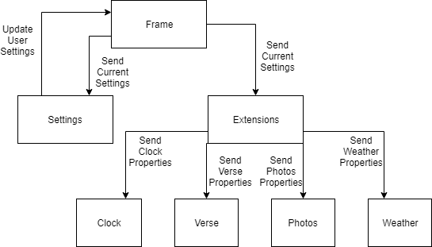

# PiFrame for Rasberry Pi
## What is PiFrame?
PiFrame is a photo frame application, designed to run on the Rasberry Pi. I have wanted to build something with a Pi for a while, so decided I'd make something sentimental for my fiancee's 21st birthday.

## User Manual
#### Shopping List
You will need a few supplies. You can look around for better deals on different products, or go for a bigger screen, but here is what I used:
- Rasberry Pi 3B
- 8 GB micro SD card 
- 7 inch touchscreen for Rasberry Pi
- 1 HDMI cable
- 2 microUSB cables
- 1 USB keyboard (for setup)
- 1 USB mouse (for setup)

#### Setup
Step 1) Download Raspbian following instructions here: https://thepi.io/how-to-install-raspbian-on-the-raspberry-pi/

Step 2) Move the SD card into your Pi, plug it up to the screen, and power on!

Step 3) Open up the terminal and download this git repository (in the `/pi/home` directory): `git clone https://github.com/jacobhjustice/PiFrame`

Step 4) Navigate into the PiFrame directory and give yourself file execute permissions for `setup.sh` and `run.sh` (i.e., `chmod +x setup.sd && chmod +x && run.sh`)

Step 5) Setup all app dependencies by running `./setup.sh`

Step 6) Run the app on startup by running `sudo crontab -e` in the terminal, and add `@reboot /home/pi/PiFrame/run.sh`

Step 7) Open app on startup by running  `sudo nano /etc/xdg/lxsession/LXDE-pi/autostart` and appending the following to the end of file:
```
@xset s off
@xset -dpms
@xset s noblank
@chromium-browser --kiosk http://localhost:3000
```

*Optional* For UI enhancements (hide mouse cursor and don't sleep screen) , run the following commands to add dependencies:
```
sudo apt install unclutter
sudo apt-get install xscreensaver
```

Then select the menu at the top left corner -> preference -> screensaver and select "disable screensaver"

Afterwards, run `sudo nano /etc/xdg/lxsession/LXDE-pi/autostart` and append `unclutter -idle 0` to the file

Step 8) Reboot the pi by runing `reboot` in the terminal. Should launch the app and open the kiosk browser to it. From this point, you'll need to enter in your User Settings by selecting the button in the bottom left to add any API keys.

## Developer Manual
#### Organization
The source code is split into two major parts: The client (`/app`) and the backend (`/server`). 

The backend holds a Flask server that is setup in `/server/run.py` (which is a good place to start if you want to look at how the backend logic works), which exposes endpoints for individual features (these are called extensions, but that's for later). The client is a React.js app that uses information from the server to display information for each feature. The base of the client is mounted in `/app/index.js`.

#### PiFrame was meant to be built upon!
Every feature within the application is called an `extension`. These extensions are made to be able to be turned on/off, and to function independantly of each other! This is great because that means any features you don't want to use can be disabled, ignored, or even removed. Even better, this methodology allows for more extensions to easilly be added! As such, each extension should exist in its own file (both in client and backend).

Every extension has three things in common: they are organized, persistent, and *always* on time! 
- *Organized*: Each extension contains attributes for itself. That's it, no tricks. Extensions are self-serving, and do not reference one another. This removes any concerns of circular dependencies, spaghetti code, etc.
- *Persistent*: Every extension exists within `Settings`, which means that it's data is stored locally and reloaded. Either via the settings interface (which calls an endpoint to update the settings), or within the server code.
- *On time*: On the client, extensions exist within the `Extensions` element (clever name, right?). Once the component is mounted (or updated.. but more on that later), all client updates are driven by a single central timer with an intereval of 1 second. This means that renders happen up to once per second (in the case of the `Clock` extension). Extensions can either choose to update after a set amount of time (`Photos` updates every 6 seconds), or at a given time (`Weather` updates on the minute).

#### To add an extension...
- Implement the {*extension_name*}Settings class within /server/extensions.py
- Add the new {*extension_name*}Settings class to the ALL_EXTENSIONS array and the `Settings` constructor in /server/settings.py 
- Add a new file for any utility functions if needed in /server/{*extension_name*}.py
- Add a new route for a REST endpoint in /server/run.py
- Implement an {*extension_name} and {*extension_name*}Properties class at minimum in /app/src/{*extension_name*}.js
- Implement client-side code in /app/src/index.js to render the extension
- Append settings for the extension within /app/src/Settings.js

When in doubt, follow an existing example! `Photos` and `Weather` are more complex models that make for a good base for future use-cases.

Below, depicts the relationship behtween Settings and Extensions in the app



## That's It!
This is everything you need to know to either dive into the code or install the application.
